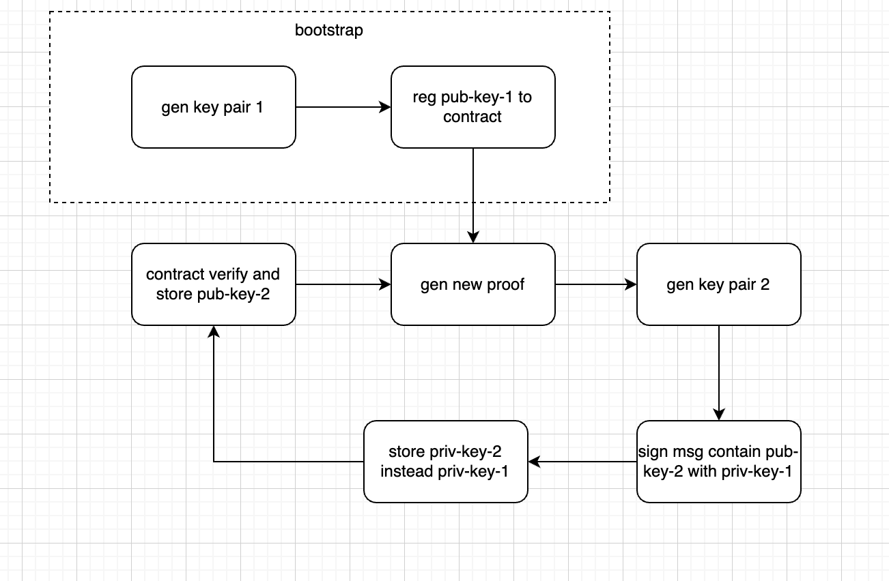

# Raiko

This project is Taiko-specific, SGX-enabled fork of [Zeth][zeth] called _Raiko_. It consists of 2 'modules': `raiko-guest` and `raiko-host`.

- `raiko-host` is capable of fetching relevant block data and saving it to the `*.json.gz` file. `raiko-host` is _not_ being run inside SGX enclave.
- `raiko-guest` is responsible for generating public-private key pair and signing. It can run inside SGX enclave.

[zeth]: https://github.com/risc0/zeth

## Building

To build the project make sure you have correct toolchain selected:

```console
ubuntu@ubuntu:~/zeth$ rustup default
nightly-x86_64-unknown-linux-gnu (default)
```

and compile the project:

```console
ubuntu@ubuntu:~/zeth$ cargo build
```

The above command creates `/target` directory with `raiko-host` and `raiko-guest` compilation artifacts.

## Running

You can either run `raiko-guest` directly, or indirectly by running `raiko-host` JSON-RPC server. In any case running it requires some [Gramine][gramine]-specific preconfiguration before you can run the binary. This can be automated in the future.

If you are running `raiko-guest` directly, you can either use _one-shot_ mode, or a _long-running RA-TLS server_ (which is experimental). Production environment uses `raiko-host` JSON-RPC server that starts `raiko-guest` in _one-shot_ mode.

To sum up, these are the ways to run `raiko-guest`:

- Run `raiko-guest` directly in:
  - _one-shot_ mode, or:
  - _long-running_ mode (RA-TLS server).
- Run `raiko-host` that in turn runs `raiko-guest` in _one-shot_ mode.

[gramine]: https://github.com/gramineproject/gramine

### One-shot mode

To run `raiko-guest` in _one-shot_ mode with SGX using Gramine:

1. Compile Gramine's configuration file:
   ```console
   ubuntu@ubuntu:~/zeth$ cd target/debug
   ubuntu@ubuntu:~/zeth/target/debug$ cp ../../raiko-guest/config/raiko-guest.manifest.template .
   ubuntu@ubuntu:~/zeth/target/debug$ gramine-manifest -Dlog_level=error -Darch_libdir=/lib/x86_64-linux-gnu/ raiko-guest.manifest.template raiko-guest.manifest
   ```
1. Sign Gramine's configuration file. [`MRENCLAVE`][mrenclave] – a.k.a. [_measurement_][measurement] – is also calculated at this stage (see last line of the below log):

   ```console
   ubuntu@ubuntu:~/zeth/target/debug$ gramine-sgx-sign --manifest raiko-guest.manifest --output raiko-guest.manifest.sgx
   Attributes:
       size:        0x10000000000
       edmm:        True
       max_threads: 16
       isv_prod_id: 0
       isv_svn:     0
       attr.flags:  0x4
       attr.xfrm:   0x3
       misc_select: 0x0
   SGX remote attestation:
       DCAP/ECDSA
   Memory:
       000000ffffff3000-0000010000000000 [REG:R--] (manifest) measured
       000000fffff73000-000000ffffff3000 [REG:RW-] (ssa) measured
       000000fffff63000-000000fffff73000 [TCS:---] (tcs) measured
       000000fffff53000-000000fffff63000 [REG:RW-] (tls) measured
       000000fffff13000-000000fffff53000 [REG:RW-] (stack) measured
       000000ffffed3000-000000fffff13000 [REG:RW-] (stack) measured
       000000ffffe93000-000000ffffed3000 [REG:RW-] (stack) measured
       000000ffffe53000-000000ffffe93000 [REG:RW-] (stack) measured
       000000ffffe13000-000000ffffe53000 [REG:RW-] (stack) measured
       000000ffffdd3000-000000ffffe13000 [REG:RW-] (stack) measured
       000000ffffd93000-000000ffffdd3000 [REG:RW-] (stack) measured
       000000ffffd53000-000000ffffd93000 [REG:RW-] (stack) measured
       000000ffffd13000-000000ffffd53000 [REG:RW-] (stack) measured
       000000ffffc53000-000000ffffc93000 [REG:RW-] (stack) measured
       000000ffffc13000-000000ffffc53000 [REG:RW-] (stack) measured
       000000ffffbd3000-000000ffffc13000 [REG:RW-] (stack) measured
       000000ffffb93000-000000ffffbd3000 [REG:RW-] (stack) measured
       000000ffffb53000-000000ffffb93000 [REG:RW-] (stack) measured
       000000ffffb43000-000000ffffb53000 [REG:RW-] (sig_stack) measured
       000000ffffb33000-000000ffffb43000 [REG:RW-] (sig_stack) measured
       000000ffffa49000-000000ffffa53000 [REG:RW-] (data) measured
   Measurement:
       3c2ef3d06dfb2ebb3ba664d82439f4636138c8d0cfd63793d47bb030f07125ca
   ```

   The above command creates `raiko-guest.sig` file (next to `raiko-guest.manifest.sgx`). You can check [`MRSIGNER`][mrsigner] and [`MRENCLAVE`][mrenclave] values by running:

   ```
   ubuntu@ubuntu:~/zeth/target/debug$ gramine-sgx-sigstruct-view ./raiko-guest.sig
   Attributes:
    mr_signer: 669b80648c2d9c97f32263fa1961f95f83818682d6359758221f0e7acb9584c0
    mr_enclave: 3c2ef3d06dfb2ebb3ba664d82439f4636138c8d0cfd63793d47bb030f07125ca
       isv_prod_id: 0
       isv_svn: 0
       debug_enclave: False
   ```

1. Initialize `secrets` directory where the encrypted (or more precisely, [sealed][sealing]) private keys will be saved and rotated:
   ```
   ubuntu@ubuntu:~/zeth/target/debug$ mkdir secrets
   ubuntu@ubuntu:~/zeth/target/debug$ gramine-sgx ./raiko-guest bootstrap
   Gramine is starting. Parsing TOML manifest file, this may take some time...
   -----------------------------------------------------------------------------------------------------------------------
   Gramine detected the following insecure configurations:
     - loader.insecure__use_cmdline_argv = true   (forwarding command-line args from untrusted host to the app)
     - sys.insecure__allow_eventfd = true         (host-based eventfd is enabled)
     - sgx.allowed_files = [ ... ]                (some files are passed through from untrusted host without verification)
   Gramine will continue application execution, but this configuration must not be used in production!
   -----------------------------------------------------------------------------------------------------------------------
   Bootstrapping the app
   Next public key: 0x021d90eee5c402692fa3a3d3edd43a052367efbd6e4d26b9ca14099516525b9d09
   Entry: /secrets/priv.key
   ```
1. Run `raiko-guest` with the input file of your choice:

   ```
   ubuntu@ubuntu:~/zeth/target/debug$ gramine-sgx ./raiko-guest one-shot --blocks-data-file /tmp/ethereum/173.json.gz
   Gramine is starting. Parsing TOML manifest file, this may take some time...
   -----------------------------------------------------------------------------------------------------------------------
   Gramine detected the following insecure configurations:

     - loader.insecure__use_cmdline_argv = true   (forwarding command-line args from untrusted host to the app)
     - sys.insecure__allow_eventfd = true         (host-based eventfd is enabled)
     - sgx.allowed_files = [ ... ]                (some files are passed through from untrusted host without verification)
   Gramine will continue application execution, but this configuration must not be used in production!
   -----------------------------------------------------------------------------------------------------------------------
   Starting one shot mode
   Reading input file /tmp/ethereum/173.json.gz (block no: 173)
   Current public key: 0x021d90eee5c402692fa3a3d3edd43a052367efbd6e4d26b9ca14099516525b9d09
   Next public key: 0x02ed03055d75c4c5260fe93b067e6ed7c22232fc7b520b1b5367dfde093c06e92f
   Signature: 0x3045022100d88304d2538f3ebb80a8b4be1e20fd1516abe543031aede7fce90561303bf7e002203ca644544386f41259cfb491dcc1a40ae3f09435e2bb136cf0baf0baf6969eb0
   Detected attestation type: dcap
   Extracted SGX quote with size = 4734 and the following fields:
   Quote: 03000200<TRUNCATED>649434154452d2d2d2d2d0a00
     ATTRIBUTES.FLAGS: 0500000000000000  [ Debug bit: false ]
     ATTRIBUTES.XFRM:  e700000000000000
     MRENCLAVE:        3c2ef3d06dfb2ebb3ba664d82439f4636138c8d0cfd63793d47bb030f07125ca
     MRSIGNER:         669b80648c2d9c97f32263fa1961f95f83818682d6359758221f0e7acb9584c0
     ISVPRODID:        0000
     ISVSVN:           0000
     REPORTDATA:       3032656430333035356437356334633532363066653933623036376536656437
                       6332323233326663376235323062316235333637646664653039336330366539
   ```

ECDSA key pair is rotated every run as presented in the diagram below:



[measurement]: https://sgx101.gitbook.io/sgx101/sgx-bootstrap/attestation#enclave-measurement-aka-software-tcb
[sealing]: https://sgx101.gitbook.io/sgx101/sgx-bootstrap/sealing
[mrenclave]: https://sidsbits.com/Intel-SGX-Attestation-Part-1/#Secure-Enclave-Instantiation
[mrsigner]: https://sidsbits.com/Intel-SGX-Attestation-Part-1/#Secure-Enclave-Instantiation

### RA-TLS server

To run RA-TLS server listening on port `8080`, run the same commands as in section [`raiko-guest`](#raiko-guest-one-shot-mode) but instead of running `gramine-sgx ./raiko-guest one-shot (...)` run `gramine-sgx ./raiko-guest server`:

```console
ubuntu@ubuntu:~/zeth/target/debug$ gramine-sgx ./raiko-guest server
Gramine is starting. Parsing TOML manifest file, this may take some time...
-----------------------------------------------------------------------------------------------------------------------
Gramine detected the following insecure configurations:
  - loader.insecure__use_cmdline_argv = true   (forwarding command-line args from untrusted host to the app)
  - sys.insecure__allow_eventfd = true         (host-based eventfd is enabled)
  - sgx.allowed_files = [ ... ]                (some files are passed through from untrusted host without verification)

Gramine will continue application execution, but this configuration must not be used in production!
-----------------------------------------------------------------------------------------------------------------------

Starting RA-TLS server - listening on 127.0.0.1:8080
Detected attestation type: dcap
Successfully obtained key and certificate data.
DER Key: [48, 129, <truncated>, 193, 232, 90, 45]
DER Certificate: [48, 130, <truncated>, 118, 143]
```

### RA-TLS client

To run RA-TLS client, you need to use the following PR: https://github.com/pbeza/rust-mbedtls/pull/1 and run:

```
RUST_BACKTRACE=1 ./client 127.0.0.1:8080 [MRENCLAVE] [MRSIGNER] 0 0
```

In the above case, run:

```
RUST_BACKTRACE=1 ./client 127.0.0.1:8080 3c2ef3d06dfb2ebb3ba664d82439f4636138c8d0cfd63793d47bb030f07125ca 669b80648c2d9c97f32263fa1961f95f83818682d6359758221f0e7acb9584c0 0 0
```

In case you get the following errors when running the above command:

```
ra_tls_verify_callback: Quote: verification failed with error OUT_OF_DATE_CONFIG_NEEDED
ra_tls_verify_callback_extended_der returned -9984
```

try to run:

```
export RA_TLS_ALLOW_DEBUG_ENCLAVE_INSECURE=1
export RA_TLS_ALLOW_HW_CONFIG_NEEDED=1
export RA_TLS_ALLOW_OUTDATED_TCB_INSECURE=1
export RA_TLS_ALLOW_SW_HARDENING_NEEDED=1
```

You _may_ also need to rebuild the project:

```
cargo build --example client --verbose
```

### `raiko-host`

Copy `raiko-guest` binary:

```console
cargo build
cp target/debug/raiko-guest raiko-host/guests/sgx
cd raiko-host/guests/sgx
gramine-manifest -Dlog_level=error -Darch_libdir=/lib/x86_64-linux-gnu/ raiko-guest.manifest.template raiko-guest.manifest
gramine-sgx-sign --manifest raiko-guest.manifest --output raiko-guest.manifest.sgx
cd -
```

Start `raiko-host` JSON-RPC server:

```console
RUST_LOG=debug cargo run --bin raiko-host -- --sgx-instance-id=123
// or with specific log path
RUST_LOG=debug cargo run --bin raiko-host -- --sgx-instance-id=123 --log-path=/var/log/raiko
```

Send a request to the server:

```console
curl --location --request POST 'http://127.0.0.1:8080/' \
--header 'Content-Type: application/json' \
--data-raw '{
  "jsonrpc": "2.0",
  "id": 1,
  "method": "proof",
  "params": [
    {
      "type": "Sgx",
      "l2Rpc": "https://rpc.internal.taiko.xyz",
      "l1Rpc": "https://l1rpc.internal.taiko.xyz",
      "block": 2,
      "prover": "0x70997970C51812dc3A010C7d01b50e0d17dc79C8",
      "graffiti": "0000000000000000000000000000000000000000000000000000000000000000"
    }
  ]
}'
```

Result

```json
{
  "jsonrpc": "2.0",
  "id": 1,
  "result": {
    "type": "Sgx",
    "proof": "0000007b00ea54fe7dfc5f3ea32b9c9f3398c8ee19998987597d80627c3e227cbfb798111adaf1a8b4332c98f06c4acabb06a34f8fadc04d44596e43fb764c4d2c58752f37722b4e734a323374fa9ef5d41b2669ef1194b8"
  }
}
```

## Troubleshooting

If you are getting the following error:

```console
[P1:T1:] error: libos_init() failed in init_exec_handle: Permission denied (EACCES)
```

make sure to rerun `gramine-sgx-sign` command.
